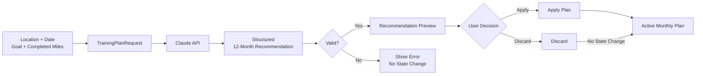

# StrideIQ

StrideIQ is a modern running analytics and adaptive planning dashboard built with **Blazor Server and .NET 9**.

The application combines real activity data from **Strava** with forecasting, configurable monthly goals, and **Claude-powered adaptive planning** to help runners track an annual mileage goal and determine how to distribute their remaining mileage throughout the year.

Rather than simply displaying historical mileage, StrideIQ helps answer a more useful question:

> Given what I've already completed, where I live, and how much of the year remains, what should my plan look like from here?

---

## Features

### Goal Tracking

* Annual mileage goal management
* Miles and kilometers support
* Manual mileage adjustments
* Year-to-date progress tracking
* Remaining mileage calculations
* Adaptive monthly targets
* Custom monthly allocation settings

### Strava Integration

* OAuth 2.0 authentication
* Automatic access-token refresh
* Year-to-date mileage synchronization
* Monthly running activity aggregation
* Actual monthly mileage derived from Strava activities

### Claude AI Adaptive Planning

StrideIQ integrates with the **Anthropic Claude API** to generate personalized recommendations for distributing a runner's remaining annual mileage.

Claude receives contextual information including:

* Runner location
* Current date
* Annual mileage goal
* Completed mileage
* Remaining mileage

The recommendation considers:

* Remaining days in the current month
* Regional seasonal running conditions
* Temperature and precipitation patterns
* Available daylight
* Gradual mileage progression
* Practical outdoor running conditions

Claude returns a structured 12-month recommendation containing:

* Monthly target mileage
* Percentage of remaining mileage assigned to each month
* Region description
* User-facing reasoning for the recommendation

Past months are preserved with zero additional mileage so the recommendation only affects the remainder of the year.

### Human-in-the-Loop AI Workflow

AI recommendations do **not** automatically modify application state.

StrideIQ uses a review workflow:

1. The runner requests an adaptive plan.
2. Claude generates a structured recommendation.
3. StrideIQ validates the response.
4. The recommendation is displayed as a preview.
5. The runner reviews the proposed monthly allocations and reasoning.
6. The runner explicitly chooses **Apply AI Plan** or **Discard**.
7. Only an approved recommendation updates the active monthly plan.

This keeps the AI advisory rather than authoritative and provides a clear boundary between generated output and application state.

### Claude Credential Options

StrideIQ supports two approaches to Claude API authentication.

#### Configured API Key

Developers running the application locally can configure an Anthropic API key using .NET User Secrets or another supported configuration provider.

#### Bring Your Own Key (BYOK)

Users can also provide their own Anthropic API key through the application.

User-provided keys are:

* Stored only for the active server-side session
* Not written to browser local storage
* Not persisted with application settings
* Isolated between Blazor user sessions
* Removed when the user disconnects or the session ends

This allows StrideIQ to demonstrate real Claude integration without requiring the application owner to fund every user's API usage.

---

## Analytics

StrideIQ provides several layers of progress analysis:

* Projected year-end mileage
* Projected goal completion percentage
* Projected finish date
* Ahead/behind pace calculations
* Daily mileage required to reach the goal
* Monthly target breakdown
* Actual vs expected monthly performance
* Goal scenario planning
* Stretch-goal projections
* AI-generated remaining-year planning

---

## User Experience

* Responsive dashboard design
* Light and dark themes
* Local persistence for user settings
* Advanced monthly allocation configuration
* Strava connection status
* Claude connection status
* AI generation loading and error states
* AI recommendation preview
* Explicit Apply/Discard workflow
* Miles/kilometers-aware recommendation display

---

## Tech Stack

* .NET 9
* Blazor Server
* ASP.NET Core
* C#
* Anthropic Claude API
* Strava API
* OAuth 2.0
* Dependency Injection
* HttpClient
* System.Text.Json
* Browser Local Storage
* .NET User Secrets

---

# Architecture

StrideIQ uses a component- and service-oriented architecture that separates presentation, application logic, external integrations, persistence, and AI-generated recommendations.

## Application Architecture

```mermaid
flowchart TB

    User([Runner])

    subgraph UI["Blazor Server UI"]
        GoalTracker["GoalTracker"]

        GoalSetup["GoalSetupPanel"]
        StatusSummary["StatusSummaryPanel"]
        ProgressComparison["ProgressComparisonPanel"]
        MonthlyProgress["MonthlyProgressChart"]
        MonthlyPlan["MonthlyPlanTable"]
        GoalScenario["GoalScenarioPanel"]
        AllocationEditor["MonthlyAllocationEditor"]
        AIPlan["AiAdaptivePlanPanel"]

        GoalTracker --> GoalSetup
        GoalTracker --> StatusSummary
        GoalTracker --> ProgressComparison
        GoalTracker --> MonthlyProgress
        GoalTracker --> MonthlyPlan
        GoalTracker --> GoalScenario
        GoalTracker --> AllocationEditor
        GoalTracker --> AIPlan
    end

    User --> GoalTracker

    subgraph APP["Application & Domain Services"]

        GoalService["GoalProgressService"]

        TrainingInterface["ITrainingPlanRecommendationService"]

        ClaudeService["ClaudeTrainingPlanRecommendationService"]

        StravaService["StravaService"]

        StravaApi["StravaApiService"]

        StravaAuth["StravaAuthService"]

        LocalStorage["LocalStorageService"]

        TrainingInterface --> ClaudeService
        StravaService --> StravaApi
        StravaService --> StravaAuth
    end

    GoalTracker --> GoalService
    GoalTracker --> StravaService
    GoalTracker --> LocalStorage

    AIPlan --> GoalTracker
    GoalTracker --> TrainingInterface

    subgraph EXTERNAL["External Services"]

        ClaudeAPI["Anthropic Claude API"]

        StravaAPI["Strava API"]

    end

    ClaudeService -->|"Structured training plan request"| ClaudeAPI
    ClaudeAPI -->|"12-month recommendation"| ClaudeService

    StravaApi -->|"Activities"| StravaAPI
    StravaAuth -->|"OAuth 2.0"| StravaAPI

    subgraph CONFIG["Configuration & Credentials"]

        UserSecrets[".NET User Secrets / Configuration"]

        BYOK["User-Provided Claude API Key"]

        BrowserStorage["Browser Local Storage"]

    end

    UserSecrets --> ClaudeService
    UserSecrets --> StravaAuth

    BYOK -->|"Session scoped"| ClaudeService

    LocalStorage --> BrowserStorage

    ClaudeService -->|"Validated Recommendation"| GoalTracker

    GoalTracker -->|"Preview"| AIPlan

    AIPlan -->|"Apply"| GoalTracker
    AIPlan -->|"Discard"| GoalTracker

    GoalTracker -->|"Approved allocations"| GoalService
```



## AI Recommendation Flow

Claude-generated recommendations are kept separate from the active running plan until explicitly approved by the user.



---

## Core Services

### `GoalProgressService`

Responsible for:

* Goal calculations
* Year progress calculations
* Remaining mileage
* Ahead/behind pace
* Projected annual mileage
* Projected finish date
* Monthly allocation logic
* Goal scenario analysis

### `StravaService`

Coordinates Strava activity data with the application.

### `StravaApiService`

Handles HTTP communication with the Strava API and activity retrieval.

### `StravaAuthService`

Handles Strava OAuth authentication and token management.

### `LocalStorageService`

Persists non-sensitive user preferences and goal settings.

### `ITrainingPlanRecommendationService`

Provides an abstraction between StrideIQ and the AI provider used to generate adaptive training recommendations.

### `ClaudeTrainingPlanRecommendationService`

Implements `ITrainingPlanRecommendationService` using the Anthropic Claude API.

Responsibilities include:

* Building the training-plan prompt
* Providing current application context
* Requesting structured output from Claude
* Deserializing Claude responses
* Validating generated recommendations
* Returning recommendations to the application for user review

Keeping the Claude implementation behind an interface prevents the rest of the application from depending directly on a specific AI provider.

---

## Structured AI Output

Claude is instructed to return a structured recommendation rather than unrestricted conversational text.

The response contains:

* Region description
* Concise reasoning summary
* Remaining mileage
* Exactly 12 monthly allocation records
* Target mileage for each month
* Percentage of remaining mileage for each month

StrideIQ validates the generated recommendation before presenting it to the user.

Important constraints include:

* All 12 months must be represented
* Past months receive no additional mileage
* Recommended mileage represents the remaining annual goal
* The user's annual goal is never modified by Claude
* Generated recommendations require explicit user approval before affecting the active plan

This allows AI-generated output to participate in the application's domain logic without giving the model direct control over application state.

---

# Configuration

Sensitive credentials should **never be committed to source control**.

## Strava

StrideIQ requires Strava API credentials for activity synchronization.

For local development, sensitive Strava configuration can be stored using .NET User Secrets.

Example:

```bash
dotnet user-secrets set "Strava:ClientSecret" "YOUR_STRAVA_CLIENT_SECRET"
```

Additional Strava configuration may be required depending on your application registration.

## Claude

A configured Anthropic API key can also be stored using .NET User Secrets:

```bash
dotnet user-secrets set "Anthropic:ApiKey" "YOUR_ANTHROPIC_API_KEY"
```

The Claude model can be configured through application configuration.

Users can alternatively provide their own Anthropic API key through the StrideIQ interface for the duration of their session.

---

# Security Considerations

StrideIQ separates sensitive credentials from persisted user preferences.

* API secrets should be supplied through secure configuration providers such as .NET User Secrets or environment variables.
* User-provided Anthropic API keys are not stored in browser local storage.
* BYOK credentials exist only within the user's active server-side session.
* User-provided credentials are isolated between Blazor sessions.
* Credentials are not included in training-plan prompts.
* AI-generated output is validated before it can affect application state.
* AI recommendations require explicit user approval before being applied.
* Disconnecting Claude removes the session-scoped user API key.

---

# Screenshots

## Dashboard — Dark Mode


---

## Dashboard — Light Mode


---

## Monthly Analytics


---

## Stretch Goal Planning


---

## Claude Adaptive Planning


---

# Future Enhancements

Potential future improvements include:

* Historical year-over-year comparisons
* Achievement system expansion
* Race-date-aware training recommendations
* Preferred running-day constraints
* User-defined AI planning preferences
* Live weather data as additional AI planning context
* More detailed training-load considerations
* MAUI desktop application
* Additional AI recommendation providers through the existing service abstraction

---

# What I Learned

StrideIQ began as a mileage goal tracker and evolved into an application integrating external APIs, analytics, persistence, responsive UI design, authentication, and generative AI.

## .NET / Blazor

This project provided hands-on experience with:

* Blazor Server component architecture
* Component parameters and event callbacks
* Dependency injection
* Service abstractions
* Application state management
* Async API operations
* Responsive UI development
* Light and dark theme support

## API Integration

* OAuth 2.0 authentication flows
* Access-token refresh
* Third-party REST API integration
* `HttpClient`
* JSON serialization and deserialization
* API error handling
* External service isolation

## AI Engineering

The Claude integration provided hands-on experience with:

* Integrating an LLM into a .NET application
* Prompt design for structured domain-specific output
* Supplying application context to an LLM
* Structured JSON responses
* Application-side AI output validation
* Separating generated recommendations from application state
* Human-in-the-loop approval workflows
* Bring Your Own Key credential handling
* Session-scoped secret management
* AI provider abstraction through dependency injection

## Application Design

* Forecasting and analytics logic
* Data visualization
* Local persistence
* Separation of concerns
* External service abstractions
* Secure configuration management
* Designing application boundaries around non-deterministic AI output

---

# Author

**Michael Cowell**  
Senior Software Engineer